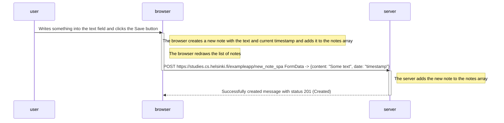

```mermaid
sequenceDiagram
    participant user
    participant browser
    participant server

    user->>browser: Writes something into the text field and clicks the Save button

    activate browser
    Note right of browser: The browser creates a new note with the text and current timestamp and adds it to the notes array
    Note right of browser: The browser redraws the list of notes

    browser->>server: POST https://studies.cs.helsinki.fi/exampleapp/new_note_spa FormData -> {content: "Some text", date: "timestamp"}
    deactivate browser

    activate server
    Note right of server: The server adds the new note to the notes array
    server-->>browser: Successfully created message with status 201 (Created)
    deactivate server
```
